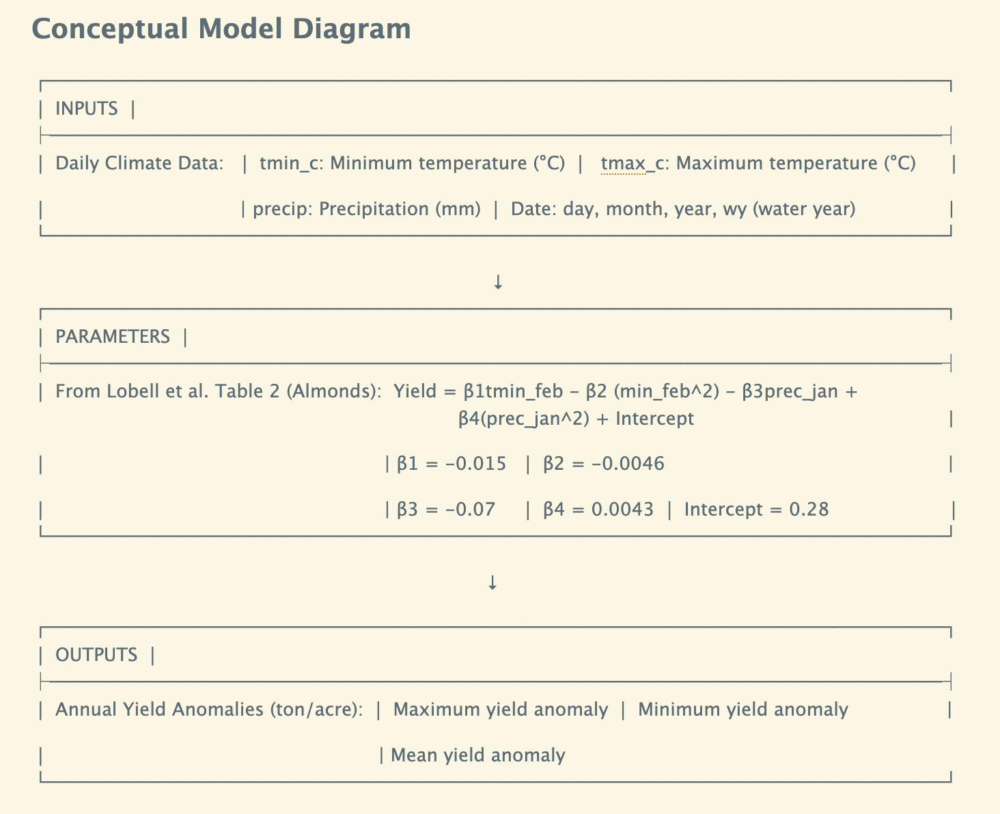

```{r setup, include=FALSE}
knitr::opts_chunk$set(echo = TRUE)
```

# ASSIGNMENT 3 Almond Yields

Lobell et al., 2006 used data to build models of tree crop yield for California that captured how climate variation (place and time) might influence yield

-   Yield anomaly

-   Climate variables

Assumptions...as you work think about what these are...

# Assignment

For this assignment you will work in *pairs*

Your goal is to implement a simple model of almond yield anomaly response to climate

-   Inputs: daily times series of minimum, maximum daily temperatures and precipitation

-   Outputs: maximum, minimum and mean yield anomoly for a input time series

The Lobell et al. 2006 paper will be the source for the transfer function that you will use in your model; specifically look at the equations in table 2.

# What you will do - Model Set Up

1.  Draw diagram to represent your model - how it will translate inputs to outputs, with parameters that shape the relationship between inputs an outputs - on your diagram list what your inputs, parameters and outputs are with units



2.  Implement your diagram as an R function

```{r}
#| message: false
#| warning: false

# Load necessary libraries
library(tidyverse)
library(here)
library(janitor)

# Read in data
climate <- read_table(here("week 3/clim.txt")) %>% 
  clean_names()
```

Here are some ideas to think though. The climate data is going to need to be processed (e.g note that the model uses climate data from a particular month - you have ALL of the climate as daily data). Here are two possible model outlines to follow

● Almond_model \<- function(clim_var1, clim_var2, parameters){……}

● Almond_model \<- function(clim, parameters){……}

The first example is where the climate variables are separately input into the function - climate data is processed beforehand as part of model set up

The second is where a climate data frame is the input to the function and you extract the useful data from it as part of the model.

```{r}
# Initialize function
alm_yield <- function(climate_data){
  
  # Find mean minimum temperature in February of each year
  climate_month <- climate_data %>% 
  filter(month == 2) %>% 
  group_by(year) %>% 
  summarize(min_temp_feb = mean(tmin_c))
  
  # Find total precipitation in January of each year 
  precip_month <- climate_data %>% 
    filter(month == 1) %>% 
    group_by(year) %>% 
    summarize(precip_sum_jan = sum(precip))
  
  # Extract necessary variables from respective dfs
  tmin_feb <- climate_month$min_temp_feb
  prec_jan <- precip_month$precip_sum_jan
  
  # Apply formula to variables
  yield <- (-0.015 * tmin_feb) - (0.0046 * (tmin_feb)^2) - (0.07 * prec_jan) + (0.0043 * (prec_jan)^2) + 0.28
  
  # Print resulting yield
  print(yield)
}

```

You can pick which option you prefer (or try both) If you want a coding challenge, you could create a model that works for any crop

# Run the model

3.  Run your model for the **clim.txt** data that is posted on Canvas,

**clim.txt** has the following columns

these 4 columns tell you when climate observations were made

-   *day*
-   *month*
-   *year*
-   *wy* (water year)

the next 3 columns are the climate observations

-   maximum (*tmax_c*) daily temperature
-   minimum (*tmin_c*) daily temperature
-   precipitation (*precip*) on that day in mm

```{r}
# Running function on climate data
alm_yield(climate_data = climate)
```

# Check your work

I will tell you that

-   the maximum almond yield anomaly should be approximately 1920 ton/acre
-   the lowest almond yield anomaly should be approximately -0.027 ton/acre
-   the mean almond yield anomaly should be approximately 182 ton/acre

```{r}
#| echo: false

 # Find mean minimum temperature in February of each year
  climate_month <- climate %>% 
  filter(month == 2) %>% 
  group_by(year) %>% 
  summarize(min_temp_feb = mean(tmin_c))
  
  # Find total precipitation in January of each year 
  precip_month <- climate %>% 
    filter(month == 1) %>% 
    group_by(year) %>% 
    summarize(precip_sum_jan = sum(precip))
  
  # Extract necessary variables from respective dfs
  tmin_feb <- climate_month$min_temp_feb
  prec_jan <- precip_month$precip_sum_jan
  
  # Apply formula to variables
  yield <- (-0.015 * tmin_feb) - (0.0046 * (tmin_feb)^2) - (0.07 * prec_jan) + (0.0043 * (prec_jan)^2) + 0.28

# Model results
print(paste("Min almond yield:", round(min(yield), 2)))
print(paste("Max almond yield:", round(max(yield), 2)))
print(paste("Mean almond yield:", round(mean(yield), 2)))
```
